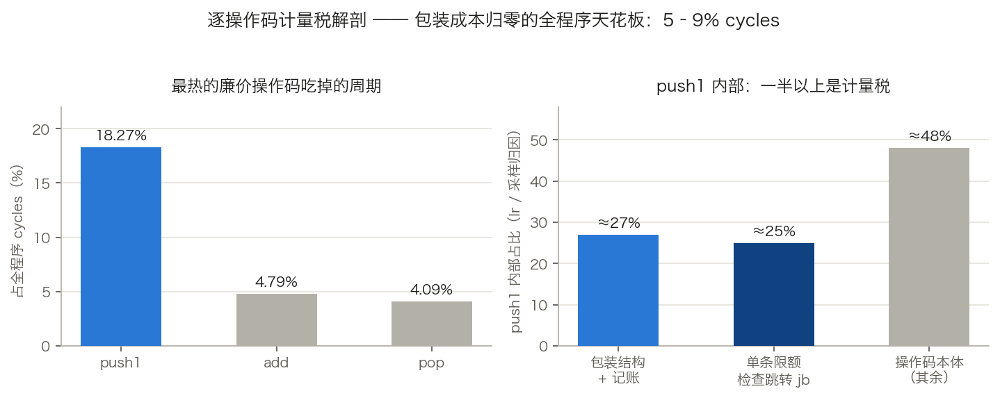
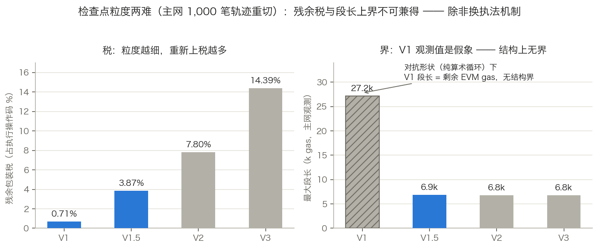
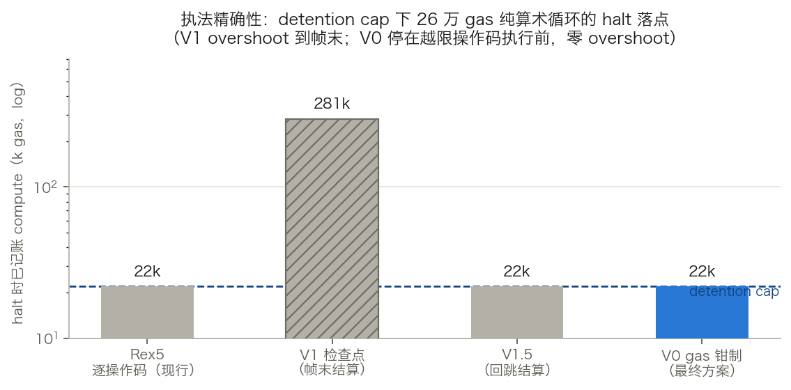
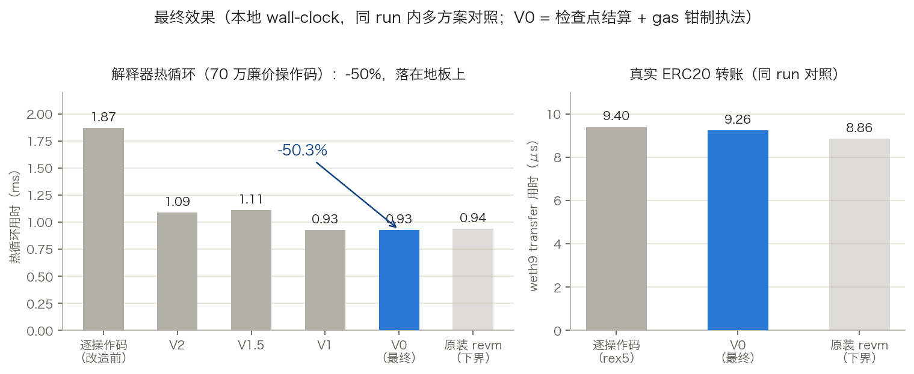

# 检查点式 Compute Gas 记账 —— 设计与验证报告（REX7）

> 🕵️ **TL;DR**
>
> mega-evm 给每条操作码都包了一层 compute gas 记账，对廉价高频操作码这是一笔与本体相当甚至更高的固定税；PR #313 已在"逐位不变"约束下把能省的都省完，剩余 5–9% 全程序周期是"检查逐操作码存在"本身的成本——删掉它必须动不变式，因此以新 spec **REX7** 发布。
>
> **目的**：普通操作码零计量税，同时不越限交易逐位等价、限额与 detention 执法不弱化。
>
> **做了什么**：
>
> - **检查点结算**：约 140 个普通操作码直接接 revm 原装指令，compute gas 在检查点按解释器 gas 差值一次结算；
> - **粒度探索三轮收敛**：V1（无跳转检查点）→ 发现纯循环段无界、撤回 → V2 被 V1.5 支配淘汰 → **V0（gas 钳制执法）当选**；
> - **V0 可行性原型验证通过**：钳制解释器可见余量，revm 自身的逐操作码 gas 检查成为执法工具——零 overshoot，halt 提前到越限操作码执行前。
>
> **结果如何**：
>
> - 解释器热循环（70 万廉价操作码）**1.87 ms → 0.93 ms（-50%）**，与原装 revm 地板持平；真实 ERC20 转账同 run 快于逐操作码记账；
> - **1,182 项既有测试零改动全绿**；激活钳制下 `GAS` 返回值、compute 总量、回执与逐操作码逐位一致；
> - 执法比现行更紧：越限操作码在执行前被拦下，detention 在无检查点纯循环内零 overshoot。

## 一、方法与方案

### 1.1 税在哪里：问题定位

MegaEVM 给每个操作码都包了一层 compute gas 记录（`evm/instructions.rs` 里的 `compute_gas_ext::*`）：每执行一条指令，就把该操作码的 gas 记入 `AdditionalLimit` 并检查一次每交易 compute gas 限额。
对昂贵操作码这笔记账开销可以忽略，但对真实执行流中占绝对多数的廉价高频操作码，它是一笔与操作码本体相当甚至更高的固定税。

PR #313（已合并，"trim per-opcode hot path"）是对同一笔税的上一刀：把 `record_compute_gas` 从每操作码扫四维收窄为只查 compute 一维（其余三维挪到各自变更位点 latch，即现行资源限额检查协议的由来），并拆出精简包装宏让约 95 个简单操作码甩掉用不上的子帧 gas 分支。
它的边界是**逐位不变**：halt 仍落在恰好越限的那个操作码上，行为零变化，因此无需新 spec。

|          | PR #313                                  | 本设计（检查点记账 + V0 钳制）                                                    |
| -------- | ---------------------------------------- | --------------------------------------------------------------------------------- |
| 思路     | 逐操作码检查**做便宜**（少查维、精简宏） | 普通操作码的检查**整个移除**，结算挪到检查点、执法交给 revm 自身的 gas 检查       |
| 不变式   | halt 落点逐位不变                        | 不越限交易逐位相同；越限交易 halt 提前到越限操作码执行前（V0 钳制，零 overshoot） |
| spec     | 不需要                                   | 必须 REX7                                                                         |
| 收益量级 | 常数因子级                               | 5–9% 全程序周期                                                                   |

两者是接力关系：本轮全部测量的基线已包含 #313 的成果，剩余的税（如 `jb` 检查跳转占 `push1` 采样 25%）是"检查存在本身"的成本；自动补丁搜索在"逐位不变"约束下确证已无可削（见 2.1），所以需要动不变式本身。
本设计的 latch 协议调整也直接搭在 #313 建立的 latch 机制上——只是把浮出点从"下一次 `record_compute_gas`"挪到"下一个检查点"。



| 指标                                           |                       值 |
| ---------------------------------------------- | -----------------------: |
| `push1` 占全程序 cycles / instructions / Ir    | 18.27% / 23.72% / 20.08% |
| `add` 占 cycles / instructions                 |            4.79% / 6.49% |
| `pop` 占 cycles / instructions                 |            4.09% / 5.59% |
| `push1` 内部记账包装占比（Ir 归因）            |          约 27% 的 push1 |
| `push1` 内部记账包装占比（`perf annotate` 带） |            35–50% 的采样 |
| 单条限额检查跳转 `jb`                          |     25.05% 的 push1 采样 |
| **包装成本归零时的全程序天花板**               |       **5–9% 的 cycles** |

这不是微架构病理：全局分支 miss 率仅 0.093%，`push1` 只占分支 miss 的 0.79%、icache miss 的 0.78%，稳态 page fault 为零。
成本就是逐操作码检查的比较/记录/跳转指令本身被执行了——这也是任何原位改写都删不掉它的原因：按现行语义，检查必须逐操作码存在。

注意范围：`push1` 只是测量中最大的单项代表——它是真实字节码中出现频率最高的操作码（每个常量入栈、每个跳转目标偏移都是一条 PUSH）。
同样的固定税落在**每一个**被包装的普通操作码上（表中 `add`、`pop` 呈现完全同构的占比结构），**5–9% 的天花板是整个包装族的合计，不是 `push1` 单项**。
昂贵操作码（`SSTORE` 等）不在此列：它们的包装成本相对操作码本体可忽略（检查点处约 99% 的 gas 质量是 `SSTORE` 本体），且它们在新方案中本来就作为检查点继续保留包装。

### 1.2 方案：检查点结算

REX7 下，指令表把**全部约 140 个普通操作码直接接到 revm 原装指令**——无包装、无逐操作码记录。
Compute gas 在每个检查点结算：

```text
段内 compute gas = 解释器 gas（上一检查点） - 解释器 gas（当前）
                   - 段内已单独记录的非 compute gas
```

检查点 = 本来就必须包装的位置（storage gas 操作码 `SSTORE`/`LOG0`–`LOG4`/`SELFDESTRUCT`、`CALL` 族、`CREATE`/`CREATE2`、volatile/detention 操作码）+ `GAS`（V0 需要，见 1.3）+ 帧进出。
由于所有记录非 compute gas 的位置（storage gas 附加费）本身就是检查点，减项是精确的。
结算值记入 `ComputeGasTracker`，随后执行完整的四维限额检查，浮出任何已 latch 的越限。

**精确性不变式：不越限交易的记账总量与逐操作码记账逐位相同。**
解释器的 gas 计数器本来就计量每个操作码（含内存扩展等动态部分）；按差值结算得到完全相同的总和。
从不越限的交易——绝对多数——逐字节不受影响：gas 相同、回执相同、状态相同。
越限交易的 halt 语义由执法机制决定，见 1.3。

### 1.3 执法：V0 gas 钳制

结算解决"记多少"，执法解决"何时停"。
朴素的"检查点才检查"会让越限交易多跑一段（overshoot），而段长上界正是整个探索的主战场（见 2.2）；最终当选的执法机制是 **V0 gas 钳制**，它让 overshoot 概念整个消失：

- 在每个检查点和帧进出/续跑处，把解释器**可见**剩余 gas 钳到 compute 余量（帧级预算与 TX 级含 detention 余量的较小值，并记住绑定方），差额隐藏；
- 普通段内只有纯 compute 操作码消耗 gas，revm 自身的逐操作码 gas 检查就成了执法工具——越限操作码在钳制边界"假 OOG"、**执行前**被拦下，零附加税、零 overshoot；
- 下一检查点先恢复隐藏余量再跑本体，`CALL` 转发、`GAS` 读数、storage 扣费全部看到真实计数器；帧末恢复隐藏量入帧结果，假 OOG 按绑定方重分类（帧级 → revert、TX 级 → halt），detention 归因保持 `VolatileDataAccessOutOfGas` 与现行一致。

代价是设计复杂度，三处必须处理：`GAS` 操作码必须入检查点集（否则钳制值可被合约观测，破坏精确性不变式）；假 OOG 需在帧结果层识别、还原并重分类；`CALL` 族的 63/64 转发必须在检查点先恢复真实余量再计算。
**可行性验证已通过**（实现侧原型，检查点原型分支），验证细节与证据见 2.4。

### 1.4 协议调整与不改什么

- **资源限额检查协议**：变更位点仍然立即 latch 越限（规则 1 不变——这些位点全是检查点）；latch 的浮出点从下一次 `record_compute_gas` 改为下一个检查点；规则 1 的 `debug_assert` 相应移位。
- **Detention**：volatile 操作码保持包装并照旧设 cap；V0 下钳制余量含 detention 余量，执法精确到操作码、无 overshoot。
- **Halt 落点规则（V0，已定）**：越限操作码在执行前于钳制边界假 OOG，帧末还原隐藏余量并按绑定方重分类（帧级预算绑定为帧 revert，TX 级/detention 绑定为 TX halt，detention 归因保持 `VolatileDataAccessOutOfGas`），剩余 gas 照旧保留用于退款。
  **双超界角点已裁定：compute 判定优先**——越限操作码同时超出真实 EVM 余量与 compute 余量时，判为 compute/detention halt（带 rescue 退款）而非 EVM OOG 燃尽。
  理由：帧末无法区分二者（OOG 时无操作码成本信息）；该角点仅在两类余量于同一操作码同时耗尽的刀尖出现；方向优待发送者且不引入新的可套利面——想避免燃尽的调用方本就可以主动 REVERT。
- **Gas 泄漏路径**（系统合约拦截、限额越限时的 gas rescue、帧返回）：`CALL` 族检查点在 `frame_init` _之前_ 结算调用方的段并恢复钳制，因此拦截短路、rescue 路径和 63/64 转发看到的都是已结算、真实域的状态；帧返回检查点在子帧 gas 合并回父帧前结算子帧并恢复钳制。
- **检查点集合修正**：按长度计费的动态成本操作码 {`KECCAK256`、`CALLDATACOPY`、`CODECOPY`、`RETURNDATACOPY`、`MCOPY`} 单个即可烧掉远超码长界的 gas；V2/V1.5 类方案必须把它们入检查点集（主网执行占比 <0.72%，包装税可忽略），V0 钳制对此天然免疫。
  `EXTCODECOPY` 已在 volatile 检查点集内，`EXP` 动态部分封顶 1,600 gas 可忽略；剩余的 `MLOAD`/`MSTORE` 一次性内存扩张是现行逐操作码执法同样存在的单操作码敞口，V0 下同样被钳制精确拦截。
- **不动 revm**：MegaEVM 本来就注入自己的指令表；本设计只改变哪些表项带包装，解释器循环、revm 原生 gas 计量、全部 revm 指令实现保持原装，revm 的 gas 计数器就是结算数据源与执法工具。
- **所有既有 spec 逐字节冻结**：逐操作码表继续为 ≤ REX6 接线；检查点表只为 REX7 接线，沿用现有的按 spec 指令表模式。
- **Storage gas、data size、KV 更新、state growth 四路记账**保持现有记录位点和语义不变；这些位点按构造就是检查点。

---

## 二、观测与探索记录

### 2.1 测量方法

五条互相独立的手段交叉验证：

1. **硬件计数器背离研究**（AMD EPYC 9754，钉核，每计数器组 5 轮取 median/MAD）：逐函数的 cycles、instructions、IPC、分支 miss、L1 icache miss、page fault，并与 Callgrind Ir 份额交叉对照。
2. **`push1` 指令级解剖**（Callgrind 文件/行归因 + `perf annotate`）：最热操作码里，操作码本体和记账包装各占多少。
3. **检查点 overshoot 模拟**：回放逐操作码 gas 轨迹，按候选检查点粒度切段（V1 = 仅现有必包装位置；V2 = V1 + `JUMP`/`JUMPI`；V3 = V2 + `JUMPDEST`；后补 V1.5 = 仅回跳结算），测量段长的 gas 加权分布——即越限 halt 最晚会落到多远——覆盖合成/probe 语料和 **1,000 笔真实主网交易**（chain id 4326，区块 22,085,597–22,086,184，`debug_traceTransaction`，共 9,737,035 个执行操作码；n=100 与 n=1000 之间分布已收敛）。
4. **自动补丁搜索**（可编辑面在通过变异敏感度门、并把差分 oracle 强化到可观测四维用量与 halt 标签之后，扩展到 `limit/limit.rs`、`limit/compute_gas.rs`、`limit/frame_limit.rs`）：没有找到任何安全的原位优化——证明这笔税是结构性的，不是实现失误。
5. **实现侧原型差分**（检查点原型分支）：把每个候选真实接进 REX6 指令表，用同一套 criterion 基准组（vanilla revm / op-revm / equivalence / rex4 / rex5 / rex6 同 run 对照）测 wall-clock，用全量测试套件（1,182 项，含 REX5↔REX6 逐位平价断言）做行为差分——模拟给方向，原型给实证。

三类硬件指标在探索中的分工与读数：

- **IPC（周期对指令的背离）是主力**，两个核心发现都由它给出。
  主探针全局 IPC 3.42（SSTORE/LOG 负载 2.823，CREATE 负载 3.366）；逐函数背离比给出 `push1` = 0.77（高 IPC 纯计算，税是真周期，Ir 看得见——支撑本设计的收益估计），以及反方向的 `HashMap::get_mut` = 9.02×、`hashbrown::rustc_entry` = 4.9×、`FoldHasher::hash` = 4.15×（低 IPC 访存瓶颈，合计约 12% 周期——Ir 失明的状态访问局部性矿脉，归属大头在 revm 上游，另列一线，不在本设计范围内）。
- **Cache miss 用于证伪**：`push1` 的 L1 icache miss 份额仅 0.78%（对比其 18.27% 周期），驳掉"包装宏代码膨胀撑爆 I-cache"假设；同族的分支 miss 全局仅 0.093%，`push1` 占 miss 的 0.79%，派发表不进榜，驳掉"解释器派发打爆分支预测器"假设。
- **Page fault 用于排除**：major fault 为 0，稳态（第 2–5 秒）0 faults/s，与全部发现无关。

### 2.2 探索主线：粒度的三次收敛

#### 第一轮：overshoot 模拟初判 V1

检查点方案下，普通操作码不再包装；越限交易的 halt 落到下一个检查点，最多多执行一段。
段长的 gas 加权分布：

| 来源        | 变体 |  p50 / p90 / p99 / max（gas） | 残余包装操作占比 |     可收回收益 |
| ----------- | ---- | ----------------------------: | ---------------: | -------------: |
| 合成+probe  | V1   |  45,512 / — / 50,002 / 50,002 |            3.02% |     4.85–8.73% |
| 合成+probe  | V2   |     184 / — / 50,002 / 50,002 |            4.04% |     4.80–8.64% |
| 合成+probe  | V3   |     184 / — / 50,002 / 50,002 |            5.26% |     4.74–8.53% |
| 主网 n=1000 | V1   | 665 / 4,325 / 26,935 / 27,151 |        **0.71%** | **4.96–8.94%** |
| 主网 n=1000 | V2   |      57 / 168 / 6,706 / 6,772 |            7.80% |     4.61–8.30% |
| 主网 n=1000 | V3   |      60 / 168 / 6,705 / 6,771 |           14.39% |     4.28–7.71% |
| 主网 n=1000 | V1.5 |     194 / 317 / 6,753 / 6,861 |  3.87%（等效）\* |     4.81–8.65% |

\* V1.5 等效残余税 = V1 位点完整结算 0.66% + 回跳完整结算 1.91% + 非回跳跳转的轻量方向判断 5.19%×0.25（按轻量成本 ≈ 完整结算 25% 的点估计折算）。
回跳占执行流 1.91%，全部跳转占 7.10%；码长界经验验证：250,080 个段检查，0 反例。



真实合约代码是跳转密集的：把 `JUMP`/`JUMPI`（V2）乃至 `JUMPDEST`（V3）设为检查点，等于给主网 7.8% / 14.4% 的执行操作码重新上税——恰恰是要消除的廉价操作码税；V1 让 99.3% 的执行操作码完全免税。
初版据此裁定 V1，并推导"24 KB 合约按 1 字节 3 gas 直线执行约 73k gas、直线无法成环"的码长上界。
原型第一轮（V1 接线）实测：热循环 1.87 ms → 0.93 ms（-50%），落在原装 revm 地板上——收益侧完全兑现。

#### 第二轮：循环洞——V1 裁定撤回

**猜想**：73k 码长上界对 V1 成立（"直线无法成环"）。
**验证**：该推理只在 `JUMP`/`JUMPI` 是检查点时成立，而 V1 恰恰不含跳转——一个十几字节的纯算术循环（`JUMPDEST; …; JUMPI` 回跳）内部没有任何 V1 检查点，段会跨越任意多次迭代。
实现侧测试钉住：detention cap 1000 下，逐操作码记账（Rex5）在 cap 附近停住；V1 原型把 26 万 gas 的循环整个跑完，直到帧末结算才 halt。
**结论**：V1 的段长上界实际是**剩余 EVM gas**，不是码长；compute 限额对循环密集代码退化为建议值，detention 有效界变成 `cap + 剩余 gas`，破坏"访问易变数据后快速终止"的并行目标。
测量数据中的 `synth_jump_loop` V1 段长 45,512 也是同一现象——它受负载形状约束，不是结构界。
**V1 裁定据此撤回**，粒度重开为待定问题。

#### 第三轮：候选重开与逐一定夺

- **V2（`JUMP`/`JUMPI` 全设检查点）**：段无法跨越跳转，码长上界恢复；原型实测热循环 1.09 ms（对 V1 回吐约三分之一收益）。
  **被 V1.5 支配淘汰**：两者结构上界相同（码长界），主网实测尾部几乎相同（max 6,861 vs 6,772），而 V1.5 的完整结算税（2.57%）远低于 V2（7.80%）——V2 相对 V1.5 没有任何优势维度。
- **仅回跳结算（V1.5）**：`JUMP`/`JUMPI` 仍包装但只在回跳（目标 < 当前 PC）时完整结算；只经前向跳转的段内 PC 单调前进，段操作数受码长约束；每次循环迭代付一次结算——这是任何要给循环设界的方案的内禀成本。
  主网重切：回跳占执行流 1.91%，段长 p50/p99/max = 194/6,753/6,861，码长界 250,080 段零反例，等效残余税 3.87%，可收回 4.81–8.65%；最长段即算术热循环体（POP/MULMOD/SWAP/DUP），正是靠回跳边界切开——机制按设计工作。
  原型实测：最坏形状（回跳占跳转 100% 的热循环）1.11 ms，与 V2 同价；功能面上钉住 V1 循环洞的测试按预期翻转——halt 从帧末（compute 281k）收回到回跳处（compute 22k ≈ cap + 一次迭代）。
  µs 级单笔 ERC20 负载对各粒度变体无区分度（代码布局噪声 ±5% 盖过差异），残余税定值以主网轨迹重切为准。
- **码长界的第二个洞（检查点集合修正）**：即便有了跳转检查点，"1 字节 3 gas"的推导也只对常数费用操作码成立——`KECCAK256`（6 gas/字）等长度计费操作码单个即可烧掉远超码长界的 gas（24 KB 直线塞满 1 MiB 输入的 `KECCAK256`，单段约 6 亿 gas）。
  V2/V1.5 须把五个长度计费操作码并入检查点集（主网占比 <0.72%，代价可忽略）；`MLOAD`/`MSTORE` 的一次性内存扩张无法经济地检查点化，只能表述为"与现行逐操作码执法等同、不因本设计引入的单操作码敞口"。
  这把 V2/V1.5 的上界钉成了**相对式**：相对逐操作码执法的额外 overshoot ≤ 约 73k，绝对界仍然做不到。
- **V0（gas 钳制执法）**：对上述全部问题天然免疫——无 overshoot、无段长界问题、无动态计费敞口，普通操作码零附加税，且比现行执法更紧（越限操作码执行前拦下 vs 现行执行完才检查）。
  按既定规则（可行性验证通过则选 V0）完成原型验证后，**粒度封定为 V0**：零 overshoot、比现行执法更紧、热循环贴 V1/原装 revm 地板、残余税最低（V1 位点 0.71% + `GAS` ≲0.1%）。
  V1.5 作为已测完备的回退方案归档（回跳结算，4.81–8.65% 收回，变体补丁留存）。



### 2.3 主网数据佐证（热度与限额逼近度）

REX7 归类下的主网执行流（1,000 笔）：**普通操作码占执行次数 92.20%**（gas 质量仅 13.26%——gas 被 LOG/SLOAD/SSTORE 主导），检查点类占 7.34% 次数 / 57.63% gas，volatile 类 0.47% / 29.12%。
5–9% 天花板的前提（绝大多数执行次数免税）在真链按执行次数口径成立；gas 质量口径与包装税无关，不作前提。

长度计费五操作码合计执行占比 < 0.72%（`KECCAK256` 0.626% 为主，其余 ≤0.073%），本窗单次最大 gas 仅 716——入检查点集的包装税实测可忽略。
本窗未出现"单次烧穿码长界"的极端大拷贝（样本偏小输入），理论敞口仍在，检查点集修正保留。

限额逼近度：单笔 compute 总量 p50/p99/max = 56,495 / 485,145 / 2,279,067，对 200M per-tx 限额仅 0.028% / 0.24% / 1.14%；**99.9% 的交易触碰 volatile 数据**，post-access 用量对 20M cap 为 2.4% / 11.4%（p99/max）。
含义：真实流量远离一切 binding cap——**overshoot 是正确性上界的设计问题，不是高频用户可见行为**（触限案例 hard 0、near 4）。
这不弱化上界要求（对抗形状仍需容纳），但说明执法机制选择不会造成现网可感知的行为面变化。

### 2.4 原型实测效果（V0）



各方案在解释器热循环基准（70 万廉价操作码，本地 wall-clock，criterion 同 run 内含 vanilla revm / equivalence / rex5 对照行）：

| 方案                 |  热循环用时 | vs 逐操作码 | 执法语义                     |
| -------------------- | ----------: | ----------: | ---------------------------- |
| 逐操作码（改造前）   |     1.87 ms |           — | halt 在越限操作码（执行后）  |
| V2（跳转全结算）     |     1.09 ms |        -42% | overshoot ≤ 码长界（相对式） |
| V1.5（仅回跳结算）   |     1.11 ms |        -40% | overshoot ≤ 码长界（相对式） |
| V1（无跳转检查点）   |     0.93 ms |        -50% | overshoot 无界（已否决）     |
| **V0（钳制，最终）** | **0.93 ms** |    **-50%** | **零 overshoot，halt 提前**  |
| 原装 revm（下界）    |     0.93 ms |           — | —                            |

V0 与 V1 同速——钳制只在检查点付费，普通段零附加税；同 run 的 rex5（逐操作码代表）与 equivalence 行波动 <2%，是测量有效性的对照。
真实 ERC20 转账（weth9 transfer，同 run）：V0 9.26 µs，快于逐操作码 rex5 的 9.40 µs，对 equivalence（8.86 µs）残余差距约 4.5%——来自帧钩子、storage gas 检查点、拦截器分发等非指令税。

V0 等价与执法证据清单：

- **不越限逐位等价**：全量 1,182 项测试零改动全绿（含 REX5↔REX6 平价套件的 compute_gas / gas_used 逐位断言）、workspace 1,325 全绿；该主张经监督者独立复跑核实（passed 1,182 / failed 0 / exit 0）；专项测试证明激活钳制下 `GAS` 返回值、compute 总量、回执与 Rex5 逐位一致。
- **执法精确**：专项测试证明越限交易 halt 在越限操作码执行前（Rex5 记入越限操作码、usage 超限；V0 的 usage 停在限额内），detention 在无检查点纯循环内零 overshoot，halt reason 保持 `VolatileDataAccessOutOfGas` 归因。
- **泄漏路径**：拦截、rescue、帧返回三条路径由既有测试覆盖，钳制在帧边界处恒为已恢复状态（`CALL` 检查点在 `frame_init` 前恢复，帧末结算恢复入帧结果）。
- **门禁**：clippy 零新增警告、fmt、riscv no_std、cargo bench 本地全部通过。

### 2.5 相关工作对照：为什么不采用 evmone 的 basic block 校验

evmone（advanced 解释器）的高效 gas 计算算法：装载期把字节码切成 basic block（`JUMPDEST` 开块，`JUMP`/`JUMPI`/终结指令收块），预计算每块的静态 gas 总和与栈需求，运行时**块入口一次校验**代替逐操作码校验；`GAS`/`CALL` 需要精确 gas-left，用每指令附带的修正常数还原，不为它们切块。
评估结论：思想已殊途同归，机制不适用于我们的任何一个维度，不采用。

先记三个同源点：

- 他们的 basic block ≈ 我们的段（块界恰好是我们淘汰的 V2/V3 粒度）；
- 他们的 `GAS`/`CALL` 修正常数（预计算）≈ 我们的钳制恢复恒等式"真实 = 可见 + 隐藏"（运行时维护）；
- 他们"块入口预扣整块 gas、halt 提前到块入口，因 OOG 燃尽帧 gas 且回滚全部效果而无共识影响"的论证，与 V0"halt 提前到越限操作码执行前"的裁定同构——主流实现的现成先例。

不采用的原因，按维度：

1. **mega compute 维——V0 已经比它更粗、且更强。**
   块预计算的前提是费用静态可知（每操作码基础费是编译期常数）。
   V0 钳制下普通段内零检查零记账，结算位点（V1 位点 0.71% + `GAS`）比块界（主网 7.8–14.4%）稀疏一个量级；块界当结算点我们实测过（热循环 +17%）。
   预计算省的是"段总额的计算"，而我们检查点成本的大头是记账机器（RefCell + 记录 + 四维浮出），不在计算上；且钳制执法根本不需要段界，"块入口一次校验"没有需求对象。
2. **revm 原生 gas/栈检查（地板本身）——检查长在够不着的地方。**
   我们贴着的 equivalence 地板内部，是 revm 每条指令函数体自带的 `gas!` 扣费与栈检查——不在解释器循环里，换指令表消不掉。
   仿照 evmone 必须给约 140 个普通操作码提供"无检查体"的自制实现，外加按 code hash 缓存的装载期块分析和 EVM gas 的 `GAS`/`CALL` 修正值。
   技术可行、共识论证成立（同上第三个同源点），但等于用约 140 份手抄的共识关键指令体替换 revm 原装——掏空本设计"revm 原装指令即正确性来源"的信任论证，且每次 revm 升级都要逐一重审。
   归入 revm 上游 / 自研解释器长线（见后续方向），不属于 REX7。
3. **storage gas 维——无静态成分可预计算，且成本结构不是"检查"。**
   SSTORE 收不收、收多少取决于槽的原值/现值/新值与 SALT 桶容量，CALL 的新账户费取决于目标账户空否与转账值，LOG 的费取决于栈上操作数——全部是运行时信息，分析期连"要不要收费"都判定不了，块预计算没有对象。
   τ_state（≈68 ns/SSTORE，`sstore_100` 仍 1.51× op-revm）的构成是状态访问（SALT 桶查找、账户/槽 inspect、journal HashMap——即硬件计数器研究的低 IPC 访存矿脉）加四维记账机器；"限额检查"经 #313 降维 + latch 后只占零头，消检查省不出可见收益。
   这些维度也不是 gas 计价的，钳制式执法同样用不上；data size 等限额是 DoS 防线，执法不能推迟到帧末。
   评估为收益不大，不立项；存量杠杆是消 CALL 族 wrapper 的重复 host 查询与 revm 上游存储路径升级（pin 之后上游已把存储路径优化约 1.5×）。

---

## 三、后续方向

- **REX7 转正**：本轮验证在 REX6 原型分支上完成；按既定流程引入 `MegaSpecId::REX7`（spec 枚举、hardfork 映射、constants 段），REX6 回滚为逐操作码并冻结，检查点 + V0 机制整体平移到 REX7 门控，补 `docs/spec/upgrades/rex7.md` 升级页。
- **Tracing 兼容**：是否保留可选的逐操作码记账模式，供依赖逐操作码 compute gas 归因的调试/追踪工具使用。
- **测试计划（REX7 化）**：spec 门控的钳制执法测试（每类检查点、双超界角点、假 OOG 重分类）、四维 latch 浮出测试、三条 gas 泄漏路径测试、断言旧 spec 逐字节相同的差分回放。
- **CodSpeed 量化**：PR 化后由 CodSpeed 指令数报告量化实际收益对 5–9% 天花板的兑现程度（本地 wall-clock 已验证方向与量级）。
- **上界常数**：随 V0 当选作废（无 overshoot 即无上界常数）；若未来回退 V1.5，按相对式表述（相对现行执法额外 ≤ 约 73k）。
- **升级 revm 基座**：硬件计数器研究另行发现的低 IPC 状态访问矿脉（约 12% 周期，`HashMap`/hash 访存）归属 revm 上游，另列一线跟进；上游在我们 pin 的版本之后已把存储路径优化约 1.5×。
- **压 revm 地板本身（长线）**：消 revm 原生逐操作码 gas/栈检查的 evmone 式块级校验是已验证的路线，但只能走 revm 上游或自研解释器（不适用原因与代价见 2.5）；立项前先做"无检查指令体"消融实验测天花板。

## 附录

### 原型分支

检查点原型分支 `cz/feat/rex7-checkpoint-accounting`（基于 REX6 预览线）：热循环基准、V1 原型、V1.5/V2 变体实测、V0 钳制实现与全部专项测试；图表由 `assets/` 下的 Python 脚本产物提供。

### 数据出处

以上全部数字来自 2026 年 7 月的测量：硬件计数器背离研究、`push1` 解剖、自动补丁搜索穷尽运行、检查点 overshoot 模拟（合成语料 + 1,000 笔主网交易）、主网轨迹重切（回跳/热度/限额逼近度）、以及检查点原型分支的实现侧差分与基准。
含 SHA-256 清单的原始证据树已归档，可按需提供。
